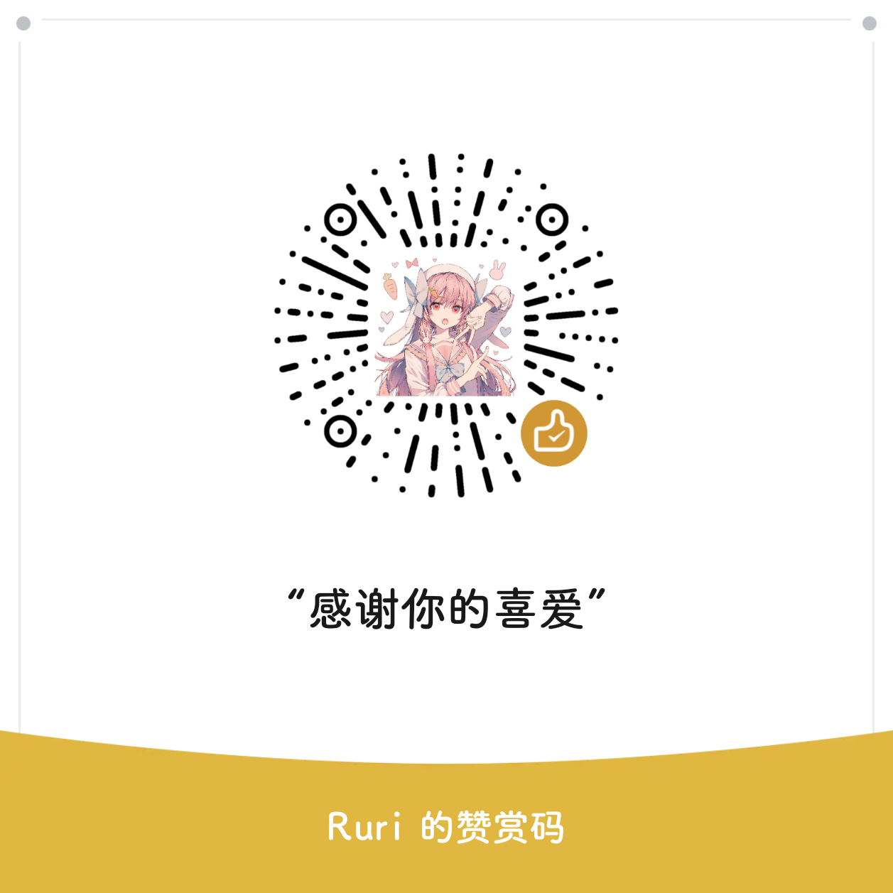

<h1 align="center" style="font-weight: bold">
  QQSyRadiant
</h1>

  酷安@水月澜花，This is a beginner's work, I hope it can help you.
 
    <a href="http://www.coolapk.com/u/2457301" target="blank"><strong>🌎 访问作者主页</strong></a>&nbsp;&nbsp;|&nbsp;&nbsp;
    <a href="https://t.me/SyRadiant" target="blank"><strong>💬 加入交流群</strong></a>&nbsp;&nbsp;|&nbsp;&nbsp;
    <a href=https://github.com/Night-WuGeng/QQSyRadiant/releases" target="blank"><strong>📦️ 下载安装包</strong></a>

---

## 基于本项目特殊性，请阅读该许可协议： [通用许可协议](https://github.com/qwq233/License/blob/master/v2/LICENSE.md)
并明确以下需要特别对您说明的内容：
- 您在下载并使用本作品时均被视为已经仔细阅读本协议并完全同意。凡以任何方式使用本作品，或直接、间接使用本作品，均被视为自愿接受相关声明和用户服务协议的约束。
- 除非本协议的当事人相互以书面的方式做出相反约定，且在相关法律所允许的最大范围内，否则作者按其现状提供本作品，对本作品不作任何明示或者默示、依照法律或者其他规定的陈述或担保，包括但是不限于任何有关可否商业性使用、是否符合特定的目的、不具有潜在的或者其他缺陷、准确性或者不存在不论能否被发现的错误的担保。有些司法管辖区不允许排除前述默示保证，因此这些排除性规定并不一定适用于您。
- 用户明确并同意其使用本作品所存在的风险及法律风险将完全由其本人承担；因其使用作品而产生的一切后果也由其本人承担，本作品作者对此不承担任何责任。
- 除非书面同意，否则在任何情况下，任何作者与协议作者，或经其修改和/或传送上述程序的任何其他方均不对您承担赔偿责任，包括任何一般的，特殊的，因本作品而使您对其他法律实体造成的一切损害。本作品及作者已提前告知您此类损害的可能性。
- 您在传播、使用本作品及其修改作品时，应自行保证您的一切行为与本作品的全部功能符合一切对您有管辖权的法律法规的要求，由您传播、使用本作品产生的法律风险及其造成的相应后果，将由您自行承担，本作品及其作者不承担任何责任。
- 本协议最终解释权归本作品作者与协议作者所有。

## 请明确以下内容
- 本项目保证永久免费，非盈利，公益；请勿二次贩卖。
- 项目尊重遵守中国法律，项目一切开发旨在学习，没有任何商业行为及用途。
- 由于项目特殊性，不希望不建议大家宣传、炫耀，作者也并不是大佬，只是一个和你们一起前行的人。
- 项目软件、源码、作品等内容，免费公开，禁止二次修改打包发布在任何网络平台，特别是国内平台，但不禁止个人打包自用，请关爱。

---

## 支持的功能/更新日志
- 禁止催更！！！

更新版本8.9.63.11390，发布全量、精简、净三个版本

全量和精简内置了模块，净采用精简底包进行了纯净打包，无内置，净版本不可以再内置模块

模块列表：QAuxiliary增强模块 QQCleaner清理模块

全量：采用官方底包直接打包模块，如精简、净产生使用BUG建议安装全量

净：采用精简底包制作，具备精简性质但没有模块附加功能和其带来的影响，最强的冷启动速度和省电效率

精简：精简UE4引擎、精简无用库和监控库日志库、精简channel日志、精简无用资源、精简无用组件、精简应用权限、精简服务及活动、精简QQ直播、精简QQ商城、减少广告、减少后台、减少游戏推广、精简game相关服务、优化缓存占用、精简VIP相关活动、加入防更新

三个版本同一个签名，可互相覆盖 

更多内容可自行探索 有问题也建议自己先行尝试解决，作者是个人维护，精力没那么多

---
## 赞助一杯Coffee/给作者喵喂一口猫娘/猫粮！

- 由于项目的特殊性，该赞助明确与项目无关，本项目完全免费，仅仅作为用户喜欢作者捐赠打赏，本项目不贩卖软件，所有内容不作为商业行为。
- 特别标注：SyRadiant中出现的赞助版非通过赞助获得，获取途径不是商业行为，非赞助而获取，仅作为喜爱作者的赞助捐赠为限制赞助版流通的措施。

## README灵感来源 / 感谢
* [QAuxiliary](https://github.com/cinit/QAuxiliary)
