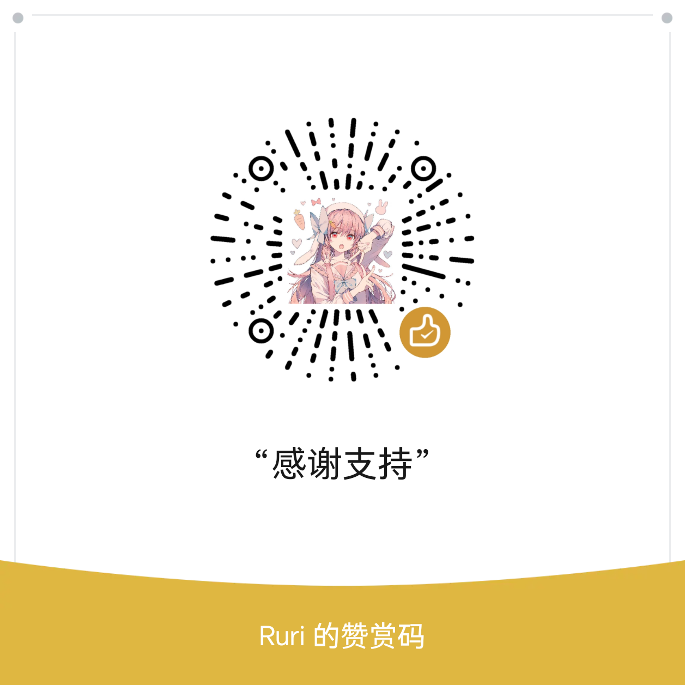
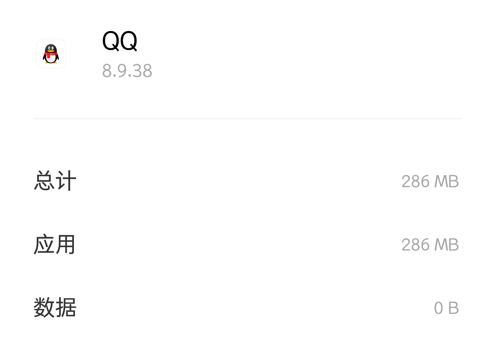

<h1 align="center" style="font-weight: bold">
  QQSyRadiant
</h1>

  酷安@水月澜花，一个基于QQ的修改项目
 
    <a href="https://t.me/SyRadiant" target="blank"><strong>💬 加入交流群</strong></a>

# 更新日志

## 更新日期 4/7
维护8.9.38Sy1.1

更新版本8.9.38 (3856)，发布全量 精简 净

全量 精简 内置模块 净无内置

模块列表：QA增强模块 QCLE清理模块 

QA新增功能 关闭群帖子

A、全量日志 官方原包制作，仅内置模块，如精简 净 发生BUG建议使用全量

B、精简日志 去除UE4组件、无用组件、日志组件和性能监控组件等，加入防更新，内置模块

C、净日志 使用精简本体制作，加入防更新，无内置模块

全量301 精简195 净191

精简参考体积 释放286 基础592 使用800

# 赞助一点Coffee

